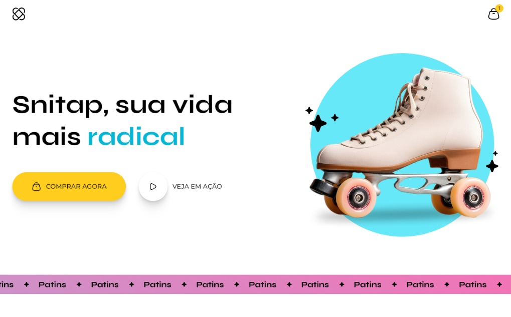

# Projeto SNITAP

## Descrição

Este é um projeto desenvolvido por mim como parte do curso na **Rocketseat**, focado em animações via CSS para um site de patins. O objetivo principal foi explorar efeitos de hover, keyframes e animações responsivas, criando uma experiência visual dinâmica para o usuário.

## Screenshots

**Desktop:**  

**Mobile:**  

## Tecnologias Utilizadas

- HTML5
- CSS3 (incluindo keyframes e animações)
- Flexbox e Grid Layout
- CSS Variables
